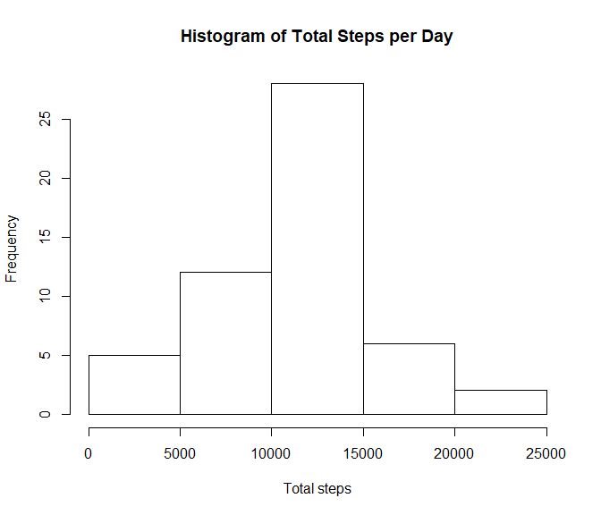

```r
options(scipen = 1, digits = 1)
knitr::opts_chunk$set(fig.dim = c(7,6))
```
## Loading and preprocessing the data

```r
activity <- read.csv("activity/activity.csv")
activity$date2 <- as.Date(activity$date, format = "%Y-%m-%d")
```
## Q1: What is mean total number of steps taken per day?


```r
activity.val <- activity[!is.na(activity$steps),]
step.total <- aggregate(steps ~ date2, activity.val, sum)
hist(step.total$steps, main = "Histogram of Total Steps per Day", xlab = "Total steps")
```

<!-- -->

```r
mean.step <- mean(step.total$steps)
median.step <- median(step.total$steps)
```

The mean and median of the total number of steps per day are 10766.2 and 10765, respectively.

## Q2: What is the average daily activity pattern?


```r
step.avg <- aggregate(steps ~ interval, activity.val, mean)
plot(step.avg$interval, step.avg$steps, type = "l", main = "Average of Steps over Interval", xlab = "Interval",
     ylab = "Step Average across Days")
```

<!-- -->

```r
max.interval <- step.avg[which.max(step.avg$steps),]$interval
max.step <- max(step.avg$steps)
```
The interval 835, on average across all the days in the dataset, contains the maximum number of steps with 206.2.

## Q3: Imputing missing values

```r
dim(activity[is.na(activity$steps),])[1]
```

```
## [1] 2304
```

The total number of missing values is 2304. 

### The strategy for imputing the missing values
Here I use the mean number of steps across all days for each 5-min interval.


```r
activity.new <- activity

## Use the mean for each 5-min interval for imputing the missing values
for (i in 1:dim(step.avg)[1]){
  idx <- which(is.na(activity.new$steps) & (activity.new$interval == step.avg$interval[i] ))
  activity.new$steps <- replace(activity.new$steps, idx, step.avg$steps[i])
}

# total # of steps for each day
step.total.new <- aggregate(steps ~ date2, activity.new, sum)
hist(step.total.new$steps, main = "Histogram of Total Steps per Day with Imputation", xlab = "Total steps")
```

<!-- -->

```r
mean.step.imputed <- mean(step.total.new$steps)
median.step.imputed <- median(step.total.new$steps)
```

The mean and median total number of steps taken per day after imputation are 10766.2 and 10766.2, respectively. The two means before and after imputation are the same due to the imputation method. The median after imputation is slightly greater than that without imputation by 1.2.

## Q4: Are there differences in activity patterns between weekdays and weekends?

```r
`%not in%` <- function (x, table) is.na(match(x, table, nomatch=NA_integer_))

activity.new$day <- weekdays(activity.new$date2)
activity.new$day2 <- replace(activity.new$day, which(activity.new$day %in% c("Saturday", "Sunday")), "Weekend")
activity.new$day2 <- replace(activity.new$day2, which(activity.new$day %not in% c("Saturday", "Sunday")), "Weekday")

step.avg.new <- aggregate(steps ~ interval + day2, activity.new, mean)

library(lattice)
xyplot(steps ~ interval|day2, step.avg.new, type = "l", main = "Average Number of Steps over Interval", xlab = "Interval",
     ylab = "Number of Steps", layout = c(1,2), cex = 1.5)
```

<!-- -->

By looking at the charts, we can tell that this individual starts activity earlier during weekday than weekend. He/she does relatively more steady activities overall during weekend than weekday. For the weekdays, the peak activity happens for the short time period around the interval 835 and the activity level decreases significantly after that; however, the activity level during weekend is more stable.  
